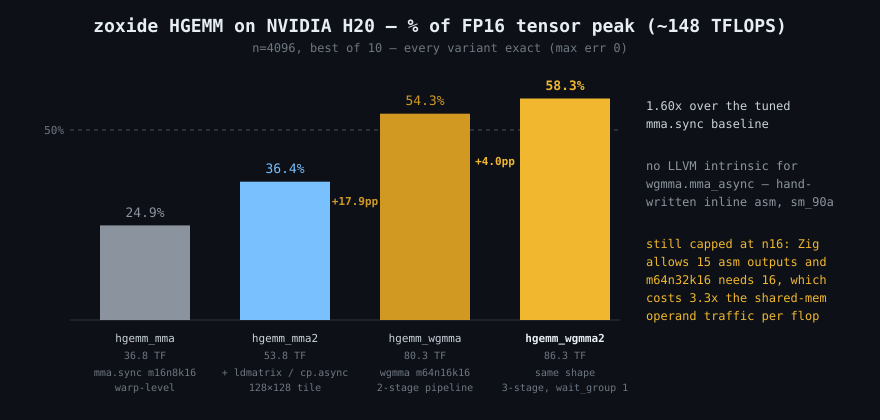

# zoxide

[](https://github.com/zig-ecosystem/zoxide/actions/workflows/ci.yml)

Zig-native CUDA kernel development: write kernels in Zig, compile to PTX with
zig 0.16's NVPTX backend, assemble and run on NVIDIA GPUs. Inspired by
[cuda-oxide](https://github.com/Rust-GPU/cuda-oxide) (a Rust CUDA compiler).
Target GPU: NVIDIA H20 (Hopper, compute capability 9.0, `sm_90`).

- **Zig version: 0.16.0** (pinned via `minimum_zig_version`; the std.Build and
  Io APIs used here are 0.16-specific)
- No GPU or CUDA toolkit needed to produce PTX; `ptxas` only for cubin
  assembly; `zoxide run` needs an NVIDIA driver (libcuda)
- Verification status: 4/4 example kernels PASS on an H20 pod — see
  [docs/verification.md](docs/verification.md)

## Use as a Zig package (downstream)

```sh
zig fetch --save git+https://github.com/zig-ecosystem/zoxide#v0.1.0
```

In your `build.zig`:

```zig
pub fn build(b: *std.Build) void {
    const zoxide = b.dependency("zoxide", .{});
    const kernel = b.addObject(.{
        .name = "my_kernel",
        .root_module = b.createModule(.{
            .root_source_file = b.path("src/kernel.zig"),
            .target = b.resolveTargetQuery(.{
                .cpu_arch = .nvptx64,
                .os_tag = .cuda,
                .cpu_model = .{ .explicit = @import("zoxide").default_sm_model },
            }),
            .optimize = .ReleaseFast,
            .strip = true,
        }),
    });
    kernel.root_module.addImport("cuda",
        @import("zoxide").addCudaModule(b, zoxide.path("src/cuda.zig"), .{}));
    kernel.bundle_ubsan_rt = false; // NVPTX rejects UBSan aliases to kernels
    b.getInstallStep().dependOn(
        &b.addInstallFileWithDir(kernel.getEmittedAsm(), .{ .custom = "kernels" }, "my_kernel.ptx").step);
}
```

Or shorter, with the all-in-one helper:
`@import("zoxide").addNvptxKernel(b, "my_kernel", b.path("src/kernel.zig"), zoxide.path("src/cuda.zig"), .{})`.
Your kernel code uses `const cuda = @import("cuda");` — see
`tests/downstream/` for a complete minimal package (built in CI).

## Requirements

- Zig 0.16.0 (with the LLVM NVPTX backend, included in standard builds)
- Optional: `ptxas` from the CUDA toolkit, for `zoxide cubin`

## Usage

```sh
zig build           # builds the `zoxide` CLI into zig-out/bin/
zig build kernels   # compiles every kernel in src/examples/ to zig-out/kernels/<name>.ptx (sm_90)
zig build kernel    # single default kernel -> zig-out/kernels/kernel.ptx (kept for compat)

zig-out/bin/zoxide doctor [--arch sm_90]                       # probe toolchain + GPU
zig-out/bin/zoxide ptx src/kernel.zig -o out.ptx [--arch sm_90]  # Zig source -> PTX
zig-out/bin/zoxide cubin out.ptx -o out.cubin [--arch sm_90]     # PTX -> cubin (needs ptxas)
```

Supported arch values: `sm_75 sm_80 sm_86 sm_89 sm_90 sm_100 sm_120`
(default `sm_90` everywhere).

`zoxide ptx` shells out to
`zig build-lib -target nvptx64-cuda -mcpu <arch> -fstrip -fno-ubsan-rt -fno-emit-bin -femit-asm=... -O ReleaseFast`.

`zoxide doctor` probes zig, the nvptx64 backend, ptxas, libNVVM and the GPU
(via `nvidia-smi --query-gpu=name,compute_cap,driver_version
--format=csv,noheader`). Every probe is tagged by severity:

- `[ok]` — present and working
- `[info]` — absent but only relevant to a future feature (libNVVM / LTOIR)
- `[warn]` — absent; only blocks part of the workflow (zig → can't compile
  new PTX; ptxas → can't assemble cubins; no GPU → fine on a dev machine)
- `[fail]` — a real error (e.g. `--arch sm_90` passed while the visible GPU
  is CC 8.6: the cubin would not load)

The exit code is 1 only when a `[fail]` item is present; `--arch` with an
invalid value is a usage error and also exits 1. The closing `summary:`
block reports readiness per workflow — `compile (zig -> PTX)`,
`assemble (ptxas -> cubin)`, `run (GPU)` — so a GPU pod without zig
correctly reports compile-unavailable but assemble/run-ready, exit 0.

## Cross-compiling for a Linux GPU pod

```sh
zig build -Dtarget=x86_64-linux-musl  --prefix zig-out/x86_64-linux-musl   # static, for ptx/cubin/doctor
zig build -Dtarget=aarch64-linux-musl --prefix zig-out/aarch64-linux-musl
zig build -Dtarget=x86_64-linux-gnu.2.28 -Doptimize=ReleaseSmall --prefix zig-out/x86_64-linux-gnu  # dynamic, for `run`
```

The musl builds are statically linked ELF executables (verified with
`file`). **For `zoxide run` prefer the gnu dynamic build**: the runner
dlopens libcuda, and a statically linked musl binary falls back to zig's
own ElfDynLib loader, which may not handle libcuda's dependency chain. The
gnu build links against glibc ≤ 2.28 symbols, so it runs on any pod image
with glibc ≥ 2.28 (Ubuntu 20.04+).

## Running kernels on the GPU (`zoxide run`)

`src/cuda_driver.zig` binds the CUDA driver API by dlopening
`libcuda.so.1` → `libcuda.so` (no cuda.h, no @cImport). On the pod:

```sh
# build PTX on the dev machine, copy to pod, then:
./zoxide run vector_add.ptx                    # assembles via ptxas, runs, verifies
./zoxide run vector_add.cubin                  # skip ptxas, load cubin directly
./zoxide run warp_reduce.ptx --grid 64
./zoxide run vector_add.ptx --kernel vector_add_$_vectorAdd   # override mangled name
```

Known examples are matched by file basename (`vector_add`, `shared_reverse`,
`warp_reduce`, `atomic_counter`); each has a hardcoded host harness that
fills inputs, launches, copies back and verifies against a CPU reference.
Expected output on success, e.g.:

```
device: NVIDIA H20
kernel: vector_add_$_vectorAdd
vector_add: n=1048576 grid=4096 block=256
PASS: vector_add n=1048576, max err 0
```

Any FAIL exits 1. Without libcuda/GPU the command prints a clear error and
exits 1 (no crash).

Driver bindings cover: cuInit, cuDeviceGetCount, cuDeviceGet,
cuDeviceGetName, cuCtxCreate_v2, cuCtxSetCurrent, cuModuleLoadData,
cuModuleGetFunction, cuMemAlloc_v2, cuMemFree_v2, cuMemcpyHtoD_v2,
cuMemcpyDtoH_v2, cuLaunchKernel, cuCtxSynchronize, cuGetErrorString,
cuGetErrorName. ABI notes: CUdeviceptr is u64; `_v2` are the real symbol
names; kernelParams is an array of pointers to argument values.

## Generating intrinsics bindings (`zoxide gen`)

`zoxide gen <cuda-oxide/intrinsics> [-o src/gen/intrinsics.zig]` consumes
cuda-oxide's catalog.json + probes/*.ll and emits `src/gen/intrinsics.zig`
(committed; regenerate only when the catalog changes). probes/*.ll are the
authoritative source for LLVM signatures (concrete `declare` lines); the
catalog contributes family/module/name metadata. Get the data by pinning a
cuda-oxide commit (the `intrinsics/` directory is self-contained; do not
vendor it here — catalog.json alone is ~365k lines). Catalog provenance:
NVIDIA PTX ISA documentation data, Apache-2.0.

Current coverage: 329 intrinsic wrappers (`src/gen/intrinsics.zig`) + 618
asm-template wrappers (`src/gen/instrinsics_asm.zig`, LLVM positional `$N`
templates rewritten to zig named operands `%[name]`). Unmapped: 163 entries,
mostly asm probes exceeding zig's inline-asm operand cap (max 15 outputs /
31 inputs — tcgen05.ld and friends) plus no-probe entries (raw sreg reads,
see cuda.zig for the common ones).

Generated bindings are re-exported as `cuda.gen` (intrinsics) and
`cuda.asm_gen` (asm-derived) — e.g. `cuda.gen.warp.ballot_sync(mask, pred)`,
`cuda.asm_gen.matrix.mma_m16n8k16_f32_f16(...)`.

Type mapping: `void`→`void`, `i1`→`bool`, `iN`→`iN`, `float/double/half`→
`f32/f64/f16`, `ptr`→`?*anyopaque`, `ptr addrspace(1)`→`[*]addrspace(.global)
const u8`, `ptr addrspace(3)`→`[*]addrspace(.shared) u8`, aggregates →
generated `Agg*` extern structs. Vectors/bfloat/immarg annotations are
currently unmapped.

## Benchmarking (`zoxide bench`)

SGEMM (C = A·B, square f32) harness with CUDA event timing:

```sh
./zoxide bench sgemm_naive.ptx --n 4096 --iters 10
./zoxide bench sgemm_tiled.ptx --n 4096 --iters 10
./zoxide bench sgemm_reg.ptx  --n 4096 --iters 10
./zoxide bench sgemm_opt.ptx  --n 4096 --iters 10
./zoxide bench sgemm_opt2.ptx --n 4096 --iters 10
./zoxide bench sgemm_swz.ptx  --n 4096 --iters 10
./zoxide bench hgemm_mma.ptx  --n 4096 --iters 10   # fp16 tensor core (mma.sync m16n8k16)
./zoxide bench hgemm_mma2.ptx --n 4096 --iters 10   # + ldmatrix, 128x128 tile, cp.async double buffer
./zoxide bench hgemm_wgmma.ptx  --n 4096 --iters 10 --arch sm_90a   # warpgroup MMA (wgmma.mma_async)
./zoxide bench hgemm_wgmma2.ptx --n 4096 --iters 10 --arch sm_90a   # + 3-stage pipeline
./zoxide bench hgemm_wgmma3.ptx --n 4096 --iters 10 --arch sm_90a   # + A from registers (RS)
```

- `sgemm_naive.zig`: one thread per C element, direct global loads (baseline).
- `sgemm_tiled.zig`: classic 32×32 shared-memory tiles, 32×32 = 1024 threads
  per block, zero-filled boundary tiles (correct for any N), both
  `syncThreads()` on the uniform loop path.
- `sgemm_reg.zig`: register-blocked 128×128 block tile, K-slice 8, 16×16 =
  256 threads, each thread accumulates an 8×8 sub-block in registers;
  inner loop uses `@mulAdd` (lowers to `fma.rn.f32` — verified in PTX);
  branchless zero-fill loads, both barriers on the uniform path.
- `sgemm_opt.zig`: sgemm_reg + 128-bit vectorized global→shared loads
  (`ld.global.v2.b64`/`st.shared.v2.b64` — LLVM's NVPTX backend emits the
  v2.b64 form rather than v4.f32) + K-slice 16 + float4 fragment loads from
  shared. Vector path requires n % 4 == 0 (16B alignment); otherwise a
  guarded scalar fallback handles the tail — correct for any N.
- `sgemm_opt2.zig`: sgemm_opt + double-buffered shared tiles (prefetch next
  K-slice into register vectors while computing the current one; 3 bar.sync
  sites: prologue + 2 per iteration, all on uniform paths).
- `sgemm_swz.zig`: sgemm_opt + bank-conflict-free B fragment reads. The
  conflict was intra-row (16 threads reading stride-8 chunks of one shared
  row hit only 4 banks → 4-way), which a row-keyed XOR swizzle cannot fix;
  instead each thread's 8 columns are remapped to two float4 chunks at
  `tx*4` and `64+tx*4`, making every v4 phase cover all 32 banks. A-fragment
  reads were already broadcast (conflict-free).

Measured on H20 (n=4096): naive 2768 GFLOPS (6.3%), tiled 4367 (9.9%),
reg 15319 (34.8%) of the ~44 TFLOPS FP32 peak; reg verified at n=4000
(non-multiple boundary) too.

- `f16_native.zig`: Zig's own `f16` and `@Vector(2, f16)`, with no wrapper layer.
  Worth an example because the absence of a layer is a deliberate finding rather
  than an omission: `a * a` becomes `mul.rn.f16`, `@mulAdd` on a
  `@Vector(2, f16)` becomes `fma.rn.f16x2`, `@max` becomes `max.f16x2`, and
  2-wide loads merge into `ld.global.b32`. A hand-written f16 arithmetic layer
  would duplicate the language. What `src/gen/` still adds is the 66 variants Zig
  has no syntax for — `ftz`, `nan`, `xorsign_abs`, `relu`, `sat`. CI asserts the
  lowering holds, since it is a property of Zig's NVPTX backend rather than of
  this repository.
- `hgemm_mma.zig`: fp16 HGEMM on tensor cores via the generated
  `cuda.asm_gen` wrapper for `mma.sync.aligned.m16n8k16.row.col.f32.f16.f16.f32`.
  Block tile 64x64, 4 warps (2x2), each warp a 2x4 grid of mma tiles (16x8),
  K-slice 16, f32 accumulators. Requires N % 16 == 0 (bench enforces).
  Fragment mapping follows the PTX ISA doc (derived in the kernel comments);
  B is stored transposed in shared so b-fragment pairs load as one u32.
  Measured on H20: 36.8 TFLOPS (24.9% of the ~148 TFLOPS FP16 tensor peak).
- `hgemm_mma2.zig`: + ldmatrix.x4/x2.trans fragment loads, 128x128 block
  tile (warp tile 64x64 = 4x8 mma), cp.async.cg 16B double-buffered pipeline
  (`cp_async_wait_group` takes a comptime immediate — the NVVM intrinsic's
  runtime i32 form does not select).
  Measured on H20: 53.8 TFLOPS (36.4% of FP16 tensor peak), exact results.


- `hgemm_wgmma.zig`: Hopper warpgroup MMA. 80.3 TFLOPS (54.3% of FP16 tensor
  peak) on H20, exact results — 1.49x over `hgemm_mma2`. One
  warpgroup (128 threads) per block, 64x128 block tile, K-slice 16, cp.async
  double buffering, both operands read asynchronously from shared memory via
  64-bit matrix descriptors. Requires `sm_90a` and n % 128 == 0.

  Two things make wgmma different from `mma.sync`. First, there is no LLVM
  intrinsic — NVVM exposes only `wgmma.fence` / `commit_group` / `wait_group`,
  never the MMA, so `src/wgmma.zig` hand-writes the instruction as inline asm.
  Second, operands are not plain 2-D arrays: the tensor core reads shared
  memory as 8x8 *core matrices* of 128 contiguous bytes, so tiles are packed
  as a sequence of core matrices and addressed through a descriptor encoding
  start address plus two inter-core-matrix byte strides.
  `src/examples/wgmma_smoke.zig` verifies exactly that layer in isolation —
  one wgmma, all 1024 accumulator elements checked against closed form with
  integer inputs so both f16 and f32 are exact:
  `./zoxide run kernels/wgmma_smoke.ptx --arch sm_90a`.

  The shape is capped at `m64n16k16` by Zig's 15-output inline-asm limit:
  `m64nNk16` needs N/2 accumulator registers per thread and every one must be
  an asm output operand, so `m64n32k16` (16 regs) is already one over. The
  kernel therefore tiles n16 eight times to cover N=128, re-reading the A
  tile from shared memory 8x per K-stage instead of once. The 54.3% above is
  achieved *with* that handicap; see `docs/upstream-asm-output-limit.md`.
- `hgemm_wgmma2.zig`: same shape, 3-stage pipeline. 86.3 TFLOPS (58.3% of FP16
  tensor peak), exact results — 1.60x over `hgemm_mma2`.

  `hgemm_wgmma` ended every K-stage with `wgmma.wait_group 0`, draining the
  tensor core. With two buffers it had no choice: the buffer about to be
  refilled is the one the previous stage's wgmma is still reading, and wgmma
  reads shared memory *asynchronously*. A third buffer breaks that — stage
  `kt` computes out of buffer `kt % 3`, `wgmma.wait_group 1` retires stage
  `kt-1` while `kt` stays in flight, and the slot that frees is
  `(kt-1) % 3 == (kt+2) % 3`, exactly the one stage `kt+2` wants.

  Worth 4.0pp, which settles a question rather than just adding speed: the
  remaining 41.7pp is *not* the pipeline. Two candidates are left and
  spec-sheet arithmetic cannot separate them — the n16 shape costs 3.3x the
  shared-memory operand traffic per flop (12.8 vs 42.7 flops/byte), while
  global traffic is 3.22 GB per pass, or 2.02 TB/s against H20's ~4 TB/s HBM.
  Deciding between them wants a profiler, not more arithmetic; see
  `docs/verification/`.

  No swizzle, deliberately: the descriptor swizzle modes keep accesses
  conflict-free when a tile retains a wide row pitch, but these tiles are
  core-matrix packed, and 128 contiguous bytes against 32 banks x 4 B already
  sweeps every bank exactly once.
- `hgemm_wgmma3.zig`: A moved from shared memory into registers (`wgmma` RS
  form). **95.2 TFLOPS (64.3% of FP16 tensor peak), exact results** — 1.77x over
  `hgemm_mma2`.

  In the all-shared form each of the 8 wgmma covering a 128-wide tile re-reads
  the whole A tile, so a K-stage pulls 20480 B out of shared memory. Loading A
  once into registers leaves 6144 B — exactly what a single `m64n128k16` would
  read, 42.7 flops/byte against 12.8. The RS form still has only 8 accumulators,
  so it fits the 15-output asm cap that blocks the wide shapes.

  A no longer feeds a descriptor, so it drops core-matrix packing for the plain
  `[64][16]` f16 layout `ldmatrix` wants. CUTLASS's `ALayout_64x16` turns out to
  be the `mma.sync m16n8k16` A-fragment layout applied to each warp's own 16
  rows — one `ldmatrix.x4` — so `hgemm_mma2`'s addressing is reused verbatim.

  An in-flight wgmma reads its A registers *after* issuing, so with
  `wait_group 1` leaving the previous stage running the fragments have to be
  double-buffered, and two things in the generated PTX had to be fixed before
  that held: a runtime array index pushed the fragments into local memory, and
  the register allocator then recycled each fragment's registers right after its
  last wgmma, collapsing the double buffer. See the comments in the kernel and
  `wgmma.fenceFragment`.

  Operand traffic now matches what a wide-N instruction would demand and the
  kernel is still 35.7pp off peak, so what remains is per-instruction cost —
  eight instructions doing one instruction's work. Measuring that needs a wider
  N, which `docs/upstream-asm-output-limit.md` explains we cannot express.

If the pod has Nsight Compute, profile with:

```sh
ncu --set full ./zoxide bench sgemm_swz.ptx --n 4096 --iters 1
# check: l1tex__data_bank_conflicts_pipe_lsu_mem_shared_op_ld
```

Output example:

```
bench: sgemm_tiled n=4096 iters=10
best: 12.345 ms over 10 iters
GFLOPS: 11150.0 (25.3% of H20 FP32 peak ~44000 GFLOPS)
PASS: 256/256 samples within rel err 1e-2 (max 0.000310)
```

Timing uses cuEventRecord/cuEventElapsedTime (min over iters); verification
checks 256 deterministic samples against an f64 CPU reference. Pod steps:
`zig build kernels` on the dev machine, copy `zig-out/kernels/*.ptx` and the
gnu-dynamic `zoxide` binary to the pod, run the two commands above.

## Device printf (`cuda.printf`)

```zig
cuda.printf("tid=%d x=%f\n", .{ tid, x });
```

ABI: LLVM removed `llvm.nvvm.vprintf`; the NVPTX backend lowers calls to a
function literally named `vprintf`. The format string is materialized as a
per-callsite `.global` constant; arguments are packed as 8-byte
little-endian slots (C varargs promotion: f32 → f64). Supported arg types:
ints (≤64-bit), f32/f64, bool. Device output reaches host stdout at the next
`cuCtxSynchronize` and is not programmatically capturable — the
`debug_print` harness in `zoxide run` is therefore fail-open (it prints what
to look for). Example: `src/examples/debug_print.zig`.

## Starting a new package

```sh
zoxide new my-thing
cd my-thing
zig fetch --save git+https://github.com/zig-ecosystem/zoxide#v0.0.11-alpha
zig build run        # needs an NVIDIA GPU
zig build ptx        # emit the PTX to zig-out/kernels/ and read it
```

`--zoxide-path <dir>` depends on a local checkout instead, which needs no
network; `--dir <path>` puts the package somewhere other than `./<name>`.

The generated package is the same shape as `tests/downstream/`, so the
integration test and the scaffold cannot disagree about the recommended layout.
It comes with a working kernel, a shared signature module, pinned staging, a
stream, and an occupancy report — enough to see all the pieces at once.

`build.zig.zon`'s `fingerprint` is filled in by asking the compiler rather than
by reimplementing its hash, which would rot the moment Zig changed it.

## Using zoxide from your own package

Both sides of a GPU program live in one package: the kernel compiles to PTX for
nvptx64, the host program embeds it and launches it. `tests/downstream/` is a
working copy of exactly this shape.

```zig
// build.zig
const zoxide = b.dependency("zoxide", .{});
const zx = @import("zoxide");

// Kernel signatures, imported by both sides so they cannot drift apart.
const abi = b.createModule(.{ .root_source_file = b.path("kernels_abi.zig") });

const obj = zx.addNvptxKernelObject(b, "my_kernels", b.path("kernel.zig"), zoxide.path("src/cuda.zig"), .{});
obj.root_module.addImport("kernels_abi", abi);

exe.root_module.addImport("zoxide_host", zoxide.module("zoxide_host"));
exe.root_module.addImport("kernels_abi", abi);
exe.root_module.addAnonymousImport("kernel_ptx", .{ .root_source_file = obj.getEmittedAsm() });
```

```zig
// kernels_abi.zig — the single source of truth for launch signatures
pub const scale = fn (x: [*]const f32, y: [*]f32, k: f32, n: u32) void;
```

```zig
// kernel.zig — device side
pub fn scale(x: [*]const f32, y: [*]f32, k: f32, n: u32) callconv(.kernel) void {
    const gid = cuda.globalThreadId();
    if (gid < n) y[gid] = x[gid] * k;
}
comptime {
    cuda.abi.assertMatches(api.scale, @TypeOf(scale));
    _ = cuda.Keep(.{&scale}).__zoxide_keep_kernels;
}
```

```zig
// main.zig — host side
const mod = try ctx.moduleFromPtx(@embedFile("kernel_ptx"));
const scale = try mod.kernel(api.scale, gpu.symbol("my_kernels", "scale"));

const dx = try ctx.allocSlice(f32, n);
try ctx.upload(dx, host_x);
try scale.launch(.{ .x = gpu.gridFor(n, 256) }, .{ .x = 256 }, .{ dx, dy, @as(f32, 2.5), @as(u32, n) });
try ctx.synchronize();
try ctx.download(host_y, dy);
```

### Streams, pinned memory and occupancy

A default-stream-only API can run a demo but not a pipeline. Transfers and
compute have to overlap, which needs a stream *and* page-locked host memory:

```zig
const stream = try ctx.createStream(true); // non-blocking
defer stream.destroy();

// Page-locked staging. This is not an optimisation detail — `cuMemcpy*Async`
// issued from ordinary pageable memory is asynchronous in name only. The driver
// stages it through an internal pinned buffer and blocks while doing so, so the
// transfer does not overlap and the stream buys nothing.
const hx = try ctx.allocPinned(f32, n);
defer hx.free();

try ctx.fillBytesAsync(dy, 0xff, stream);   // device-side memset
try ctx.uploadAsync(dx, hx.items, stream);
try scale.launchOn(stream, .{ .x = grid }, .{ .x = 256 }, 0, .{ dx, dy, k, n });
try ctx.downloadAsync(hy.items, dy, stream);
try stream.sync();
```

`ctx.zero(buf)` and `ctx.fillBytes(buf, v)` are device-side `cuMemsetD8`; an
earlier version allocated a host buffer of zeros and transferred it.

Occupancy and resource use come from the driver rather than from reading the
generated PTX:

```zig
const res = try scale.resources();       // regs/thread, static shared, spill bytes
const blocks = try scale.occupancy(256, 0);  // resident blocks per SM
```

This matters more than convenience, and there is a worked example. For
`hgemm_wgmma3` I had derived "12 blocks resident per SM" by dividing the SM's
228 KB of shared memory by the kernel's 18 KB. The driver reports **4**: at 98
registers per thread the register file binds long before shared memory does, so
the hand calculation was measuring the wrong limit and the real occupancy is 25%,
not 75%. That error had propagated into a performance conclusion before the API
existed to catch it.
`res.local_bytes` being non-zero means the kernel spilled to local memory, and on
this hardware that is severe rather than marginal: a register-cap sweep of
`hgemm_wgmma3` measured 16 spilled registers costing **45% of throughput** (64.3%
of peak down to 35.3%), and 48 spilled registers costing 71%. Worth failing a
build over. `zoxide bench` now
prints all of this per kernel, and `--maxrregcount N` passes a register cap to
ptxas for trading spills against occupancy.

### Why the signature is declared, not inferred

`cuLaunchKernel` takes `void**` — one untyped pointer per argument. Nothing
checks the count, the order or the width, and a mismatch does not fault: the
kernel reads adjacent memory and returns plausible wrong answers. The two sides
are also compiled separately for different targets, so they drift silently as a
kernel's parameters change.

Declaring the signature in a shared module turns all of that into compile errors:

| mistake | before | now |
| --- | --- | --- |
| too few / too many arguments | silent | `kernel takes 4 argument(s), got 3` |
| wrong scalar width | silent | `argument 3: kernel wants u32, got u64` |
| wrong buffer element type | silent | `argument 1: kernel wants [*]f32 but got Slice(i32)` |
| arguments transposed | silent | `argument 2: kernel wants f32, got u32` |
| host pointer instead of device | silent | `pass a Slice(f32), got [*]const f32` |
| device signature changed, host not | silent | `signature mismatch at parameter 3: declared u32, defined u64` |

The declaration omits `callconv(.kernel)` because it has to: that convention
resolves per target, and on a host architecture
`std.builtin.CallingConvention.kernel` is `unreachable`, so the type cannot be
named there. Only the parameter list matters for launching, so the comparison
ignores calling convention.

`moduleFromPtx` lets the driver JIT the PTX, which is why no ptxas is needed at
build time. Pre-assembling with ptxas and using `module` instead moves kernel
errors to build time and skips the JIT, at the cost of pinning one architecture.

## Pod verification script

Easiest path — one bundle, three commands on the pod:

```sh
curl -LO https://github.com/zig-ecosystem/zoxide/releases/download/v0.0.11-alpha/zoxide-linux-x64.tar.gz
tar xzf zoxide-linux-x64.tar.gz   # ./zoxide ./kernels/ ./scripts/
./scripts/pod-verify.sh ./zoxide ./kernels
```

CI has a second job for real hardware, gated on a repository variable
(`HAS_GPU_RUNNER=true`) rather than on runner labels alone — a job targeting an
unavailable label queues indefinitely instead of being skipped. It runs doctor,
the full sweep, `zig build run` in both `tests/downstream` and a freshly
scaffolded package, and asserts the headline kernel stays exact and unspilled.

That job exists because of a concrete miss: `tests/downstream` looked up the wrong
kernel symbol for two commits. Nothing on a machine without a GPU can detect that
— the package compiles, links and exits cleanly, and only an actual launch
notices.

`scripts/pod-verify.sh [zoxide-binary] [ptx-dir] [--quick]` runs doctor →
run × 4 examples → sgemm_swz bench smoke → intrinsics_smoke ptxas assembly,
printing one PASS/FAIL/SKIP line per check plus a totals summary, and writes
a timestamped report (`zoxide-verify-<ts>.txt`) with GPU/driver/ptxas
environment info. Missing PTX files are SKIP, not FAIL. With no GPU visible
the script degrades to SKIP for run/bench/cubin and still exits 0 (this is
what CI does). Any real FAIL → exit 1.

`scripts/k8s-gpu-verify.yaml` is a kubectl-apply-able Job template wrapping
the script (placeholder image/artifact URL — adjust for your registry).

## Device-side library (`src/cuda.zig`)

Freestanding (no host std); all device operations go through LLVM NVVM
intrinsics or Zig builtins. API overview:

| API | Lowers to |
|---|---|
| `threadIdx() / blockIdx() / blockDim() / gridDim()` → `Idx3{x,y,z}` | `llvm.nvvm.read.ptx.sreg.{tid,ctaid,ntid,nctaid}.{x,y,z}` |
| `laneId()`, `warpId()` (in-block), `globalThreadId()` | `...sreg.laneid`, `tid.x/32`, `ctaid.x*ntid.x+tid.x` |
| `syncThreads()` | `llvm.nvvm.barrier0` → `bar.sync 0` |
| `syncWarp(mask)` | `llvm.nvvm.bar.warp.sync` |
| `shflDownSync / shflUpSync / shflXorSync / shflIdxSync(T, mask, val, off)` for `i32/u32/f32` | `llvm.nvvm.shfl.sync.{down,up,bfly,idx}.i32` (f32 via bitcast) |
| `atomicAdd(T, ptr, val)` for `u32/u64/f32`, global or shared pointers | Zig `@atomicRmw` → single `atom.{global,shared}.add.*` |
| `Keep(.{ &kernelA, &kernelB })` | dummy-export DCE workaround, see below |

Example kernel skeleton:

```zig
const cuda = @import("cuda");

pub fn myKernel(out: [*]f32) callconv(.kernel) void {
    const gid = cuda.globalThreadId();
    out[gid] = 1.0;
}

comptime {
    _ = cuda.Keep(.{&myKernel}).__zoxide_keep_kernels;
}
```

The kernel's PTX symbol is mangled (`mykernel_$_myKernel`); the host must
look it up under that name.

## Example kernels (`src/examples/`)

- `vector_add.zig` — c = a + b, one f32 per thread (`globalThreadId`)
- `shared_reverse.zig` — per-block array reversal via shared memory +
  `syncThreads` (PTX shows `.shared` decl + `st.shared`/`ld.shared`)
- `warp_reduce.zig` — block-wide sum: `shflDownSync` within warps, shared
  memory + `syncThreads` across warps (`shfl.sync.down.b32`, `bar.sync 0`)
- `atomic_counter.zig` — `atomicAdd` on global u32/f32, histogram bins, and a
  shared-memory counter (`atom.global.add.*`, `atom.shared.add.u32`)

## Shared memory: verified approach

Declare a container-level variable with `addrspace(.shared)`:

```zig
var tile: [256]f32 addrspace(.shared) = undefined;
```

Zig 0.16 accepts this and the NVPTX backend emits a per-block
`.shared .align 4 .b8 <mangled>[1024];` declaration inside the `.entry`;
loads/stores lower to `ld.shared.b32` / `st.shared.b32`. No intrinsic or
`@ptrFromInt` fallback is needed.

## License

MIT (see LICENSE). The intrinsics generator consumes data from cuda-oxide's
`intrinsics/` catalog (Apache-2.0); that catalog data itself derives from
NVIDIA's PTX ISA documentation. `src/gen/intrinsics.zig` is generated output
— do not edit by hand.

## Notes on the kernel (`src/kernel.zig`)

- Freestanding vector-add kernel; reads `%tid.x` / `%ctaid.x` / `%ntid.x` to
  compute the global thread id.
- **asm operand substitution: positional forms are NOT supported; named
  forms are.** `$0` / `%0` / `${0}` / `$[name]` are all emitted verbatim into
  the PTX (ptxas: "Unknown symbol '$0'"). The working form is **named
  operands**: `asm ("mov.u32 \t%[r], %tid.x;" : [r] "=r" (-> u32))`.
  Multi-output asm works via `[out] "=r" (var)` output clauses (max 15
  outputs / 31 inputs — hard AstGen cap, which is what keeps tcgen05.ld out).
  Immediate operands use the `"n"` constraint with comptime values, or
  `std.fmt.comptimePrint` into the template. Prefer LLVM NVVM intrinsics
  where they exist (`extern fn @"llvm.nvvm.read.ptx.sreg.tid.x"() i32`);
  note `@"llvm.*"` access is technically an accident of the compiler
  (ziglang/zig#2291) and may be restricted in a future release.
- The kernel is `pub fn ... callconv(.kernel)` (not `export fn`): zig 0.16 +
  LLVM's NVPTX backend rejects `export` on kernel functions ("NVPTX aliasee
  must be a non-kernel function definition"). A dummy `export fn
  __zoxide_keep_kernels()` returning a pointer to the kernel keeps it alive
  across dead-code elimination. The kernel's PTX symbol is therefore mangled
  to `kernel_$_vectorAdd`.
- `bundle_ubsan_rt = false` / `-fno-ubsan-rt` for the same alias reason.
- **i1 in extern fns is not extern-compatible on nvptx**; map LLVM `i1`
  params/returns to Zig `bool` (verified: `vote.sync.ballot` gets a proper
  predicate register). Declaring them as `i32` crashes LLVM ("Copy one
  register into another with a different width").
- **`@ptrCast` cannot change pointer address spaces.** Declare kernel
  parameters with the target address space directly (e.g.
  `g: [*]addrspace(.global) const u8`) or use `@addrSpaceCast`.
- **`addrspace(.shared)` variables must be container-level**; a local
  `var x: [N]T addrspace(.shared)` is rejected.
- Pointer address-space syntax is `[*]addrspace(.shared) u8` (qualifier
  between `[*]` and the element type).
- `llvm.nvvm.shfl.sync.*` in current LLVM returns plain `i32` (4 args), not
  the legacy `{i32, i1}` pair — the generated bindings follow the probe
  signatures from cuda-oxide's rust-llvm-23.1.
- **Conditional code around barriers can deadlock a real GPU.** Our
  `extern fn @"llvm.nvvm.barrier0"()` declaration looks like an ordinary
  function call to LLVM's mid-level optimizer (no convergent/noduplicate
  attributes; NVPTX recognizes it by name only at codegen time), so passes
  like JumpThreading may duplicate it onto divergent program points — on
  hardware, threads that take different copies of `bar.sync` deadlock (this
  hung `atomic_counter` on the H20 pod; same class of issue as cuda-oxide
  disabling `-Z mir-enable-passes=-JumpThreading`). **`noinline` does NOT
  help** (verified: LLVM then duplicates the call instruction itself, 4×
  `call.uni` on divergent paths). Rule: never let a conditional straddle a
  `syncThreads()` — e.g. replace `if (tid == 0) smem = 0;` with an
  unconditional same-value write by all threads before the barrier. After
  changing barrier-adjacent code, grep the PTX: each `syncThreads()` must
  lower to exactly one `bar.sync 0` on the universal path. Same caution
  applies, in theory, to `syncWarp` with a full mask; warp-collective
  shuffles are single instructions and are not affected.
