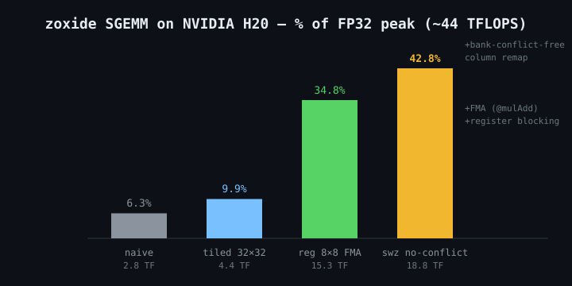

# zoxide announcements

每次发版在此追加一条公告（最新在最上），附相关图片。图片统一放 `docs/assets/`。

---

## v0.2.0-beta — SGEMM line complete（2026-09-20）

SGEMM 优化线收官：naive 2.8 TF → tiled 4.4 TF → register-blocked 15.3 TF → bank-conflict-free **18.8 TF（H20 FP32 峰值的 42.8%）**。每一步瓶颈都有诊断证据（PTX 审查 + ptxas -v + 对照实验），详见 `docs/verification/`。

关键发现：

- nvptx 后端不会自动融合 `a*b+c`，必须显式 `@mulAdd` 才有 `fma.rn`
- 行内 bank 冲突用行键 XOR swizzle 无解，正解是 fragment 列重映射（零额外指令）
- barrier 紧邻条件分支会被 LLVM 复制 → 真机死锁（与 cuda-oxide 禁用 JumpThreading 同类）

发布文案（X 线程）：

1. NVIDIA's CUDA Rust announcement nails the trend: the kernel should be written in your language, not shipped from somewhere else. We built the Zig answer — the Zig compiler's NVPTX backend emits PTX directly. No custom rustc backend, no pinned nightly, no LLVM plumbing. github.com/zig-ecosystem/zoxide
2. Verified end-to-end on a real H20 pod: 4 kernels PASS, including a GPU-deadlock hunt (LLVM duplicated bar.sync across a branch — the same JumpThreading trap cuda-oxide disables in rustc). SGEMM: 6% → 10% → 35% → 43% of FP32 peak, every step diagnosed.
3. Honest gaps vs cuda-oxide: no proc-macro safety layer yet; tcgen05/mma/TMA intrinsics blocked on Zig's asm-template limitations (689 catalog entries waiting on upstream). But 329 typed intrinsics already generated from cuda-oxide's own catalog (Apache-2.0 data reuse) 🙏

---

## v0.1.0 — first usable release, GPU-verified（2026-09-18）

首个稳定版：纯 Zig 写 CUDA kernel，zig → PTX → ptxas → cubin → GPU 执行，全链路在 NVIDIA H20 pod 真机验收（driver 550.90.07，ptxas 12.8），vector_add / shared_reverse / warp_reduce / atomic_counter 四个示例全部 PASS。

- `src/cuda.zig` 设备端库：索引/同步/warp shuffle/原子/共享内存（`addrspace(.shared)` 原生可用）
- `src/gen/intrinsics.zig`：329 个 NVVM intrinsic 类型安全封装（`zoxide gen` 消费 cuda-oxide catalog 生成）
- `zoxide` CLI：ptx / cubin / run / doctor / gen
- 下游集成：`zig fetch --save git+https://github.com/zig-ecosystem/zoxide#v0.1.0`，`addCudaModule` / `addNvptxKernel`

发布文案（X 单帖）：

> CUDA kernels in pure Zig — no CUDA SDK needed for compilation.
> zig (nvptx backend) → PTX → ptxas → H20 GPU. Verified on real hardware.
> github.com/zig-ecosystem/zoxide
