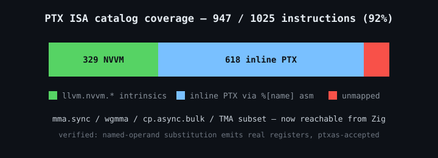
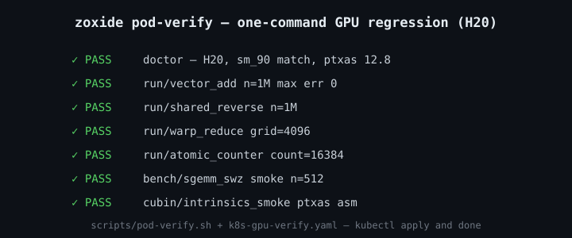

# zoxide announcements

每次发版在此追加一条公告（最新在最上），附相关图片。图片统一放 `docs/assets/`。

---

## v0.0.8-alpha — 3-stage wgmma pipeline, 58.3% of FP16 peak（2026-09-21）

**86.3 TFLOPS（FP16 峰值 58.3%），结果精确，对 mma.sync 基线累计 1.60x。**

改动只有流水线深度，shape 一字未动，所以这是一次干净的 A/B。v3 每个 K 段以 `wgmma.wait_group 0` 收尾，把 tensor core 排空——两个 buffer 下没得选：即将被重填的那个正是上一段 wgmma 还在**异步**读的。三个 buffer 破掉这个依赖，`wait_group 1` 退休 `kt-1` 而 `kt` 继续飞，空出的 `(kt-1)%3` 恰好就是 `(kt+2)%3`。

值 4.0pp。但这一步真正的价值是**排除了一个候选**：剩下的 41.7pp 不是流水线。还剩两个，而且规格书算不出谁是主因——n16 让共享内存操作数流量变成 3.3 倍（12.8 vs 42.7 flops/字节），全局流量 3.22 GB/趟 = 2.02 TB/s，占 HBM 标称的 51%。所以下一步是 profiler，不是继续拍脑袋，也不是先去打编译器补丁。

顺带撤销一项：上一轮列的共享内存 swizzle 经分析对我们无效——tile 已是 core-matrix packed，一个 core matrix 是 128 字节连续，共享内存 32 banks × 4B = 128 字节一轮，单次读取已完整跨遍所有 bank，没有冲突可消。swizzle 模式针对的是保持宽行距的布局（TMA 产出那种）。

发布文案（X 单帖）：

> Zig on Hopper: 86.3 TFLOPS HGEMM, 58.3% of H20 FP16 tensor peak, exact — 1.60x over a tuned mma.sync kernel. The win this round was letting wgmma stay async: a third buffer so wait_group 1 retires the previous stage instead of draining the tensor core. github.com/zig-ecosystem/zoxide

---

## v0.0.7-alpha — warpgroup MMA, 54.3% of FP16 peak（2026-09-21）

Hopper warpgroup MMA 落地：**80.3 TFLOPS（FP16 峰值 54.3%），结果精确，对 mma.sync 基线 1.49x**（53.8 TF / 36.4%）。

wgmma 和 mma.sync 有两处本质不同。一是 **LLVM 没有 `wgmma.mma_async` intrinsic**——NVVM 只暴露 fence / commit_group / wait_group 三条控制指令，MMA 本身只能手写 inline asm，且门控在 `sm_90a` 而非 `sm_90`（此前记录的「生成器已含 wgmma wrapper」已订正）。二是操作数不是普通二维数组：tensor core 按 **128 字节连续的 8×8 core matrix** 读共享内存，tile 必须按 core matrix 序列打包，再用 64 位描述符（起始地址 + 两个跨 core matrix 字节步长）寻址。

布局一次写对，靠的是不猜：位域与 canonical layout 从 CUTLASS `cute`（BSD-3-Clause）推导，累加器寄存器到 (m,n) 的映射用 `CLayout_64xN`。另配自检 kernel `wgmma_smoke`——发一条 wgmma，1024 个累加元素全部跟闭式重算比对，整数输入所以 f16/f32 都精确，把布局层从 GEMM tiling 里隔离出来单独验。

代价要说清楚：**54.3% 是带着 Zig 15 输出上限跑出来的**。`m64nNk16` 每线程需要 N/2 个累加器寄存器且每个都得是 asm output，`m64n32k16`（16 个）正好超 1 个，所以只能用 `m64n16k16` 铺 8 次覆盖 N=128，A tile 每段重读 8 遍。上限是 ZIR 编码的历史遗留（`outputs_len` 已是 u7），放到 32 就能用 `m64n64k16`——见 `docs/upstream-asm-output-limit.md`。

发布文案（X 单帖）：

> Hopper warpgroup MMA in pure Zig: 80.3 TFLOPS, 54.3% of H20 FP16 tensor peak, exact results — 1.49x over the mma.sync baseline. No LLVM intrinsic exists for wgmma.mma_async, so it is hand-written inline asm + 64-bit smem descriptors. github.com/zig-ecosystem/zoxide

---

## v0.0.4-alpha — tensor-core instructions unlocked（2026-09-20）

M4d 前提证伪后重启：Zig asm 的 `%[name]` 具名操作数替换确认可用（此前只试了位置形式）。生成器新增 **618 条 inline-PTX wrapper**（`src/gen/instrinsics_asm.zig`），catalog 覆盖率从 32% 提到 **92%（947/1025）**——mma.sync / TMA 子集与 wgmma 控制指令可达（`wgmma.mma_async` 本身 LLVM 无 intrinsic，须手写 asm），PTX 文本验证通过（无 `$0` 残留，真实寄存器）。上游 issue 计划撤回：只剩 `llvm.nvvm.*` 文档化一个温和诉求。剩余 163 条 unmapped 的主因是 Zig asm 的 15 输出上限（tcgen05.ld 等超宽指令）。

---

## v0.0.3-alpha — verification tooling + gpu_printf（2026-09-20）

一键 GPU 回归：`scripts/pod-verify.sh`（doctor → 4 示例 run → bench 冒烟 → ptxas 汇编，结构化报告，无 GPU 自动降级 SKIP）+ `scripts/k8s-gpu-verify.yaml`（kubectl apply 即跑的 Job 模板）。

设备端 printf 落地：`cuda.printf(comptime fmt, args)`——comptime 物化 global format 串 + C varargs 提升规则的 valist 打包（f32→f64）。调查结论：`llvm.nvvm.vprintf` 在 LLVM 19+ 已移除，正确路径是调用字面名 `vprintf` 的函数，NVPTX 后端直接识别。

发布文案（X 单帖）：

> zoxide v0.0.3-alpha: one-command GPU regression for Zig CUDA kernels — a shell script + a k8s Job template. Plus gpu-side printf via comptime-packed varargs. github.com/zig-ecosystem/zoxide

---

## v0.0.2-beta — SGEMM line complete（2026-09-20）

SGEMM 优化线收官：naive 2.8 TF → tiled 4.4 TF → register-blocked 15.3 TF → bank-conflict-free **18.8 TF（H20 FP32 峰值的 42.8%）**。每一步瓶颈都有诊断证据（PTX 审查 + ptxas -v + 对照实验），详见 `docs/verification/`。

关键发现：

- nvptx 后端不会自动融合 `a*b+c`，必须显式 `@mulAdd` 才有 `fma.rn`
- 行内 bank 冲突用行键 XOR swizzle 无解，正解是 fragment 列重映射（零额外指令）
- barrier 紧邻条件分支会被 LLVM 复制 → 真机死锁（与 cuda-oxide 禁用 JumpThreading 同类）

发布文案（X 线程）：

1. NVIDIA's CUDA Rust announcement nails the trend: the kernel should be written in your language, not shipped from somewhere else. We built the Zig answer — the Zig compiler's NVPTX backend emits PTX directly. No custom rustc backend, no pinned nightly, no LLVM plumbing. github.com/zig-ecosystem/zoxide
2. Verified end-to-end on a real H20 pod: 4 kernels PASS, including a GPU-deadlock hunt (LLVM duplicated bar.sync across a branch — the same JumpThreading trap cuda-oxide disables in rustc). SGEMM: 6% → 10% → 35% → 43% of FP32 peak, every step diagnosed.
3. Honest gaps vs cuda-oxide: no proc-macro safety layer yet; tcgen05/mma/TMA intrinsics blocked on Zig's asm-template limitations (689 catalog entries waiting on upstream). But 329 typed intrinsics already generated from cuda-oxide's own catalog (Apache-2.0 data reuse) 🙏

---

## v0.1.0 — first usable release, GPU-verified（2026-09-18）

首个稳定版：纯 Zig 写 CUDA kernel，zig → PTX → ptxas → cubin → GPU 执行，全链路在 NVIDIA H20 pod 真机验收（driver 550.90.07，ptxas 12.8），vector_add / shared_reverse / warp_reduce / atomic_counter 四个示例全部 PASS。

- `src/cuda.zig` 设备端库：索引/同步/warp shuffle/原子/共享内存（`addrspace(.shared)` 原生可用）
- `src/gen/intrinsics.zig`：329 个 NVVM intrinsic 类型安全封装（`zoxide gen` 消费 cuda-oxide catalog 生成）
- `zoxide` CLI：ptx / cubin / run / doctor / gen
- 下游集成：`zig fetch --save git+https://github.com/zig-ecosystem/zoxide#v0.1.0`，`addCudaModule` / `addNvptxKernel`

发布文案（X 单帖）：

> CUDA kernels in pure Zig — no CUDA SDK needed for compilation.
> zig (nvptx backend) → PTX → ptxas → H20 GPU. Verified on real hardware.
> github.com/zig-ecosystem/zoxide
